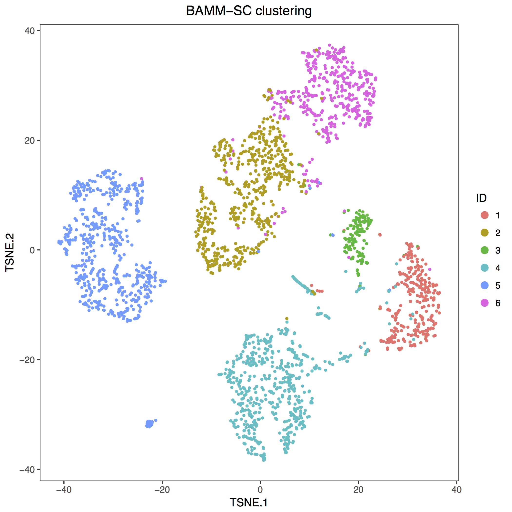
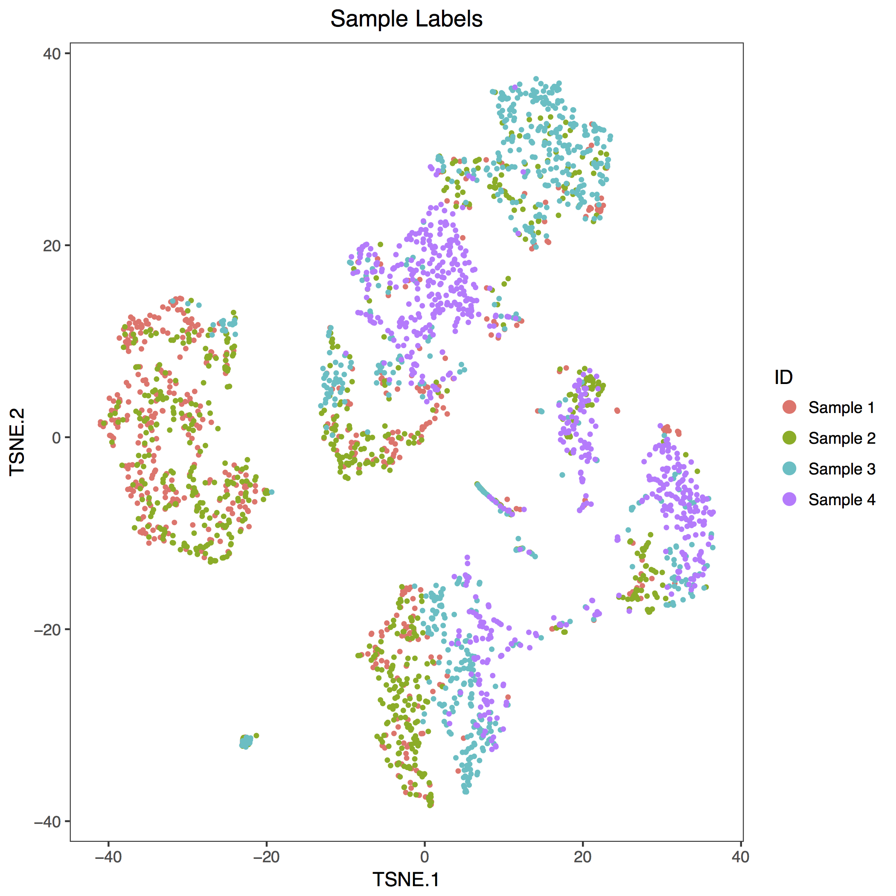

## The following R scripts are used to reproduce the results for Mouse lung dataset used in the manuscript. The processed Mouse lung data could be downloaded from the link [Mouselung](https://drive.google.com/open?id=1ldz9MztRJgr2VvlKrzU7gOO4OaCBvgEH)


```
# load packages
library(mclust)
library(BAMMSC)
library(cellrangerRkit)

# load datasets
load("Mouse_lung.rda")
load("MouseLung_ApproxTruth.Rdata")
load("MouseLung_PooledTSNE.Rdata")

# run BAMMSC
set.seed(12346)
result<-BAMMSC(count, K=6, nBurn = 500, maxIter.BAMMSC = 1500)
adjustedRandIndex(unlist(result$mem)[ApproxTruth[[1]]],ApproxTruth[[2]])

# run t-SNE, colored by clustering label
clust<-unlist(result$mem)
tsne_clust <- data.frame(Barcode=tsne_result[,1],TSNE.1=tsne_result[,2],
                         TSNE.2=tsne_result[,3],Clust=clust)
pdf(file="MouseLung_BAMMSC.pdf")
visualize_clusters(as.character(tsne_clust$Clust),tsne_clust[c("TSNE.1","TSNE.2")],
                   title="BAMM-SC clustering",marker_size=0.8)
dev.off()

# run t-SNE, colored by Sample ID #
batch<-c(rep("Sample 1",dim(count[[1]])[2]),rep("Sample 2",dim(count[[2]])[2]),
         rep("Sample 3",dim(count[[3]])[2]),rep("Sample 4",dim(count[[4]])[2]))
tsne_clust <- data.frame(Barcode=tsne_result[,1],TSNE.1=tsne_result[,2],
                         TSNE.2=tsne_result[,3],Batch=batch)
pdf(file="MouseLung_Sample.pdf")
visualize_clusters(as.character(tsne_clust$Batch),tsne_clust[c("TSNE.1","TSNE.2")],
                   title="Sample Labels",marker_size=0.8)
dev.off()
```


The t-SNE plot of clustering label is shown as:


The t-SNE plot of sample ID is shown as:

